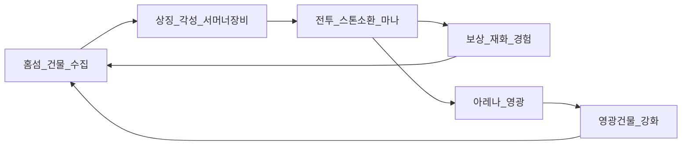

# StoneSummoner — 전체 게임 설계 (GDD)

## 1. 한 줄 컨셉

**「상징으로 몬스터를 키우고, 서머너가 마법진에서 마나를 모아 전장을 뒤집는다.」**

### 서머너즈워와 같음
- 수집·각성·**상징(룬)**·시나리오·아레나
- **홈 섬·건물 건설/강화/자원 생성**

### 서머너즈워와 다름
1. 매 행동 **마법진 스톤소환(바둑)** → 상징 화력 Amplify
2. **서머너가 직접 전투 참여** + **서머너 장비** 장착/강화
3. **마나**가 차면 서머너 스킬 — 충전 속도가 **마법진 국면에 연동**

### 비중

```text
장기 성장 ████████████ 상징(몬스터)
베이스 빌딩 ████████░░░░ 홈 섬·생산·영광건물 (SW 1:1)
보조 성장 ████░░░░░░░░ 서머너 장비
전투 운영 ██████░░░░░░ 마법진 → Amplify + 마나 충전
```

---

## 2. 핵심 루프



1. **홈(섬)**에서 생산 자원 수집·건물 건설/강화  
2. 소환·상징·서머너 장비로 스펙 확보  
3. 전투: 스톤소환 → Amplify + 마나 가속 → 몬스터/서머너 스킬  
4. 보상·영광포인트로 다시 홈 성장  

---

## 3. 문서 인덱스

| 문서 | 내용 |
|------|------|
| [home-island.md](home-island.md) | 홈 섬·건물·생산·영광건물 |
| [combat-formula.md](combat-formula.md) | BasePower × Amplify + 마나 |
| [battle-ui.md](battle-ui.md) | 전투신 UI·입력 플로우 |
| [magic-circle.md](magic-circle.md) | 마법진 모듈 A~H |
| [board-progression.md](board-progression.md) | 5→7→9 크기 · 50수 강화 리셋 |
| [symbols.md](symbols.md) | 상징 = SW 룬 1:1 |
| [summoner.md](summoner.md) | 서머너·장비·마나 스킬 |
| [monster-template.md](monster-template.md) | 몬스터 템플릿·샘플 |
| [content-map.md](content-map.md) | 콘텐츠·재화·해금 맵 |
| [refs/](refs/) | 목업·기획 시트 참조 |

---

## 4. 전투 요약

- 파티: **서머너 1 + 몬스터 4**
- 전장: 적 상단 / **중앙 마법진(5×5→7×7→9×9)** / 아군 하단
- 행동: **착수 → 국면 판정(Amplify·마나) → 스킬**
- 장기전: 9×9 **50수** 후 보드 리셋 → **강화 진문** 재개 ([board-progression.md](board-progression.md))
- 승패: **적 소환수 전멸 = 승리** / **아군 소환수 전멸 = 패배** (서머너는 후열·비대상)
- 집 계산 없음

상세: [combat-formula.md](combat-formula.md), [battle-ui.md](battle-ui.md), [magic-circle.md](magic-circle.md), [board-progression.md](board-progression.md)

---

## 5. 성장 요약

| 축 | 역할 |
|----|------|
| 상징 | 전투력·메타 **주축** (SW 룬) |
| 홈·영광건물 | 생산·전역 버프 (SW 섬) |
| 서머너 장비 | 마나 템포·서머너기 (보조) |
| 마법진 | BasePower **Amplify** + 마나 가속 |

---

## 6. Phase 1 (MVP) 범위

**목표:** 홈 수집·소환·강화 → 시나리오 전투 → 보상이 한 바퀴.

| 포함 | 나중 |
|------|------|
| 홈: 소환진·강화진·출정문·진액연못 | (Phase 2로 이동) |
| 몬스터 8~10 + 상징 2~3세트 | (Phase 2로 확장) |
| 서머너 + 장비 6부위·세트·가방 인벤 + 각성 + 마나 스킬 4 + 장비 금고 | 스킬 트리 풀 |
| 전투: **5×5→7×7→9×9** 착수·따냄·Amplify·마나 · 9×9 50수 리셋 | 모듈 B~H · 13×13 |
| 보드 아이템 2~3종 | 형상·이벤트·보스 보드 |
| 시나리오 1챕터 + 자동 | (Phase 2: 심층·아레나) |

원칙: Phase 1에서 영광 풀·모듈 풀·아레나를 넣지 않는다.

---

## 6.1 Phase 2 범위 (스텁 구현)

| 포함 | 상태 |
|------|------|
| 시나리오 챕터 2 (용맹의 탑) | [x] |
| 상징 심층 (세트별 고드롭) | [x] |
| 아레나 → 영광포인트 | [x] |
| 영광 건물 5종 (상시 버프) | [x] |
| 요일 던전 · 마법진 시련(진문석) | [x] |
| 수정 광맥 · 소원의 사당 | [x] |
| 상징 세트 8종 | [x] |
| 월드아레나 · 길드 레이드(13×13) · 융합의 별 | [x] 스텁 |

---

## 6.2 Phase 2+ (이후)

| 항목 | 상태 |
|------|------|
| 월드아레나 밴픽 UI · 시즌 | [x] 밴 최대 2 · 시즌승 스텁 |
| 길드전 실시간 · 레이드 기여도 | 실시간 후순위 · 비동기 순위·최고기여 [x] |
| 마법진 모듈 B~H 풀 | B–G + 맞마나·금기구역·축·사석수동·쌍국 [x] |
| 제작소 · 정수 공방 풀 | [x] 스텁 · 에너지 크리스탈 충전 |
| 상징 판매 · 마법진 도장 | [x] 스텁 · 도장 묘수 미션 |
| 길드 홀 (비실시간) | [x] 가입·일일 출석·순위판 |
| 월드아레나 시즌 보상 | [x] 승수 티어 수령 |

---

## 7. 기술 방향

- 바둑 룰: 독립 모듈 (`packages/board`) — 전투와 분리 테스트
- 전투: ATB + `StoneSummonPhase` + `SkillPhase`
- 데이터: JSON 테이블 (몬스터/스킬/상징/건물)
- 클라이언트: Unity 또는 Godot 4 (추후 확정)

---

## 8. 확정 결정 요약

- 홈 = SW 천공의 섬 1:1  
- 전투력 주축 = 몬스터 상징 + 영광건물 상시 버프  
- 차별점 = 마법진 스톤소환 + 서머너 참전·장비·마나  
- Amplify ≈ 0.85~1.25 (강화 진문 시 상한 상승), 상징 격차는 국면만으로 뒤집지 못함
- 보드: **5×5 → 7×7 → 9×9**, 장기전 9×9 **50수 리셋 → 강화 진문**
