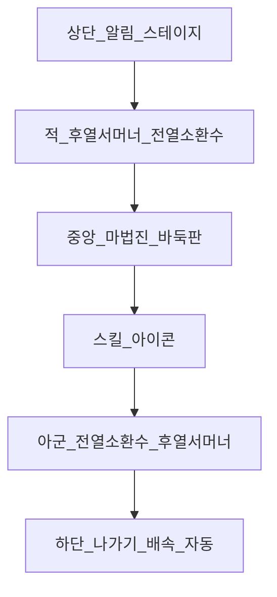

# 전투신 UI / UX

참조 목업: [refs/battle-mockup.png](refs/battle-mockup.png) (사용자 제공 시 보관)

## 1. 레이아웃 (세로 모바일)

| 영역 | 역할 |
|------|------|
| 상단 적 진영 | 적 서머너(**후열**) + 전열 몬스터 4. HP(녹)/ATB(청) |
| 중앙 마법진 | 공유 보드(**5×5 / 7×7 / 9×9**) + 마법 아우라. 화면 높이 ~18–28% (크기별) |
| 하단 아군 진영 | 전열 몬스터 4 + 아군 서머너(**후열**) |
| 스킬 3칸 | 행동 유닛 스킬. 마나 풀 시 서머너기 강조. 대상은 소환수만 |
| 마나 게이지 | 서머너 근처 4세그먼트/바 |
| 우하단 | 설정 / 배속(x1–x3) / Auto |
| 좌하단 | 나가기 |
| 좌상단 | 글로벌 알림 티커 |
| 우상단 | `맵명 N-M (웨이브/총)` |

---

## 2. 입력 플로우 (수동)

1. ATB 풀 → 해당 유닛 하이라이트 + **착수 가능점** 점등  
2. 교차점 탭 → 돌 낙하 → 따냄/아이템 → **Amplify·마나 UI 갱신**  
3. 스킬 잠금 해제 → 스킬 탭 (마나 풀이면 **서머너기** 포함) → 대상  
4. 타격 연출·데미지 플로팅 → 다음 ATB  

**규칙:** 착수 중에는 스킬 잠금. 「두고 친다」 리듬 유지.

### 반자동
- [x] AI가 착수 후보 **3점** + 예상 Amplify·마나 획득 미리보기
- [x] 플레이어가 점 선택 후 스킬은 수동 (대상 탭 지정)
- 자동: 착수 AI + 스킬 우선순위

### 자동
- 착수 AI (따냄 > 아이템 > 안전 확장)
- 스킬 우선순위 프리셋
- 마나 풀 + 서머너 턴 → 서머너기 우선 (정책 토글 가능)

---

## 3. 연출

| 단계 | 연출 |
|------|------|
| 착수 | 돌 낙하 + 마법진 문양 점화 |
| 따냄 | 돌이 빛으로 흡수 → **마나 게이지로 유입** |
| 버프 | 아이콘이 행동 유닛에게 전이 |
| 본 스킬 | SW식 히트 플래시 + `-151` 형 플로팅 |
| 서머너기 | 마법진 전면 점화 컷인 → 광역/보드 효과 |

배속 시 전투·보드 애니 모두 배속. 「보드 애니 간소화」 옵션으로 농사 최적화.

---

## 4. 보드 가독성

- 돌·아이템 고대비 (흑/백 + 원색 토큰)
- 마법 글로우는 **테두리** 위주, 격자 위 최소화
- 하이라이트: 따냄 가능점 / 아이템 / 금수 / AI 추천
- 수동 착수 시 짧은 포커스 줌 허용 후 스킬 단계로 복귀
- 마나 게이지는 항상 보여 **템포가 보이게**
- 9×9 **50수 리셋** 시: 진문 붕괴→재점화 연출 + `강화 진문 I/II` 라벨

---

## 5. Phase 1 UI 범위

- [x] 상·하 5슬롯 + 중앙 보드
- [x] HP/ATB/마나 바
- [x] 착수 탭 → 스킬 3칸
- [x] 배속·자동·나가기
- [x] 데미지 플로팅
- 알림 티커·웨이브 UI는 스텁 가능
- [x] 멀티웨이브 (소환수 전멸 시 다음 웨이브)
