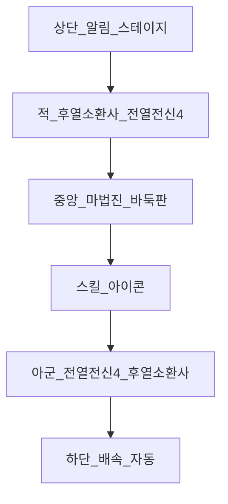

# 전투신 UI / UX

참조 목업: [refs/battle-mockup.png](refs/battle-mockup.png) (사용자 제공 시 보관)

## 1. 레이아웃 (세로 모바일 · 한 화면)

**제약:** 전투는 `100dvh` 안에서 **세로 스크롤 없이** 해결. 카드형 UI 대신 전신 스테이지 슬롯.

| 영역 | 역할 |
|------|------|
| 상단 적 진영 | 적 소환사(**후열**, 소형 bust) + 전열 몬스터 4를 **전신 스프라이트**로. 발밑 HP(녹)/ATB(청) |
| 중앙 마법진 | 공유 보드(**5×5 / 7×7 / 9×9**) + 마법 아우라. 화면 높이 ~18–28% (크기별). 보드 하단 컴팩트 마나 바 |
| 하단 아군 진영 | 전열 몬스터 4(전신) + 아군 소환사(**후열**, 소형) |
| 스킬 도크 | 행동 유닛 스킬 3 + 소환사기. 대상은 소환수 전신 탭 |
| 우하단 | 배속(x1–x3) / Auto |
| 좌상단 | 나가기 |
| 상단 | 스테이지명 · 웨이브 · 짧은 티커 (긴 전투 로그는 숨김) |

유닛 표현: `.battle-unit` — 카드/보더 없음, 전신 `object-fit: contain`, 활성·타겟 시에만 이름 표시.

---

## 2. 입력 플로우 (수동)

1. ATB 풀 → 해당 유닛 하이라이트 + **착수 가능점** 점등  
2. 교차점 탭 → 돌 낙하 → 따냄/아이템 → **Amplify·마나 UI 갱신**  
3. 스킬 잠금 해제 → 스킬 탭 (마나 풀이면 **소환사기** 포함) → 대상  
4. 타격 연출·데미지 플로팅 → 다음 ATB  

**규칙:** 착수 중에는 스킬 잠금. 「두고 친다」 리듬 유지.

### 반자동
- [x] AI가 착수 후보 **3점** + 예상 Amplify·마나 획득 미리보기
- [x] 플레이어가 점 선택 후 스킬은 수동 (대상 탭 지정)
- 자동: 착수 AI + 스킬 우선순위

### 자동
- 착수 AI (따냄 > 아이템 > 안전 확장)
- 스킬 우선순위 프리셋
- 마나 풀 + 소환사 턴 → 소환사기 우선 (정책 토글 가능)

---

## 3. 연출

| 단계 | 연출 |
|------|------|
| 착수 | **소환사 cast_place** → 맵 마법진 흡수 줄기 → 우측 미니 보드 갱신 |
| 따냄 | 강한 흡수 · 다음 소환수 +10%N 피해 버프 · 마력 +12%p×N |
| 따냄 후 타격 | 소환수 **전진(lunge)** → 히트 플래시 → 데미지 플로팅 → 복귀 |
| 버프 | 아이콘이 행동 유닛에게 전이 |
| 본 스킬 | SW식 히트 플래시 + `-151` 형 플로팅 |
| 소환사기(풀 마력) | 마법진 전면 점화 컷인 → 스킬트리 성형 고유기 |

중앙 마법진은 `perspective` + `rotateX`로 SW식 기울기. 배속 시 전투·보드 애니 모두 배속. 「보드 애니 간소화」 옵션으로 농사 최적화.

### 캐릭터 아트 (Spine)

- 전열 기본 자산은 투명 1024×1024 front/back painted WebP
- 아군/적군 전열은 공통 depth 변수로 perspective·거리·접지 그림자를 합성하며 원화 색상 필터는 사용하지 않음
- 등록 팩만 Spine 마운트: 현재 파일럿 `fire_fang` ([`docs/art/spine/fire_fang-brief.md`](art/spine/fire_fang-brief.md))
- 그 외 유닛/북 유닛은 WebP 전신 유지
- Spine 로드 실패 시 painted WebP를 숨기지 않고 즉시 fallback
- `public/art/spine/pilot/`(spineboy)는 개발용 — 전투/북에 노출하지 않음
- 아군 레인 `back` / 적 레인 `front` 스킨 (미러만으로 대체 금지)

파일럿 성능 기준:
- 유닛당 canvas 1개, 렌더 해상도는 DPR 1.5 이하, `low-power` GPU 사용
- 일반 88×132 슬롯의 최대 backing buffer는 약 132×198(단일 RGBA 버퍼 약 102KB)
- 동시 Spine 확대 전 Android WebView에서 프레임·GPU 메모리를 다시 측정

---

## 4. 보드 가독성

- 돌·아이템 고대비 (흑/백 + 원색 토큰)
- 마법 글로우는 **테두리** 위주, 격자 위 최소화
- 하이라이트: 따냄 가능점 / 아이템 / 금수 / AI 추천
- 수동 착수 시 짧은 포커스 줌 허용 후 스킬 단계로 복귀
- 마나 게이지는 항상 보여 **템포가 보이게**
- [x] 9×9 **50수 리셋** 시: 진문 붕괴→재점화 연출 + `진문 재건 I/II` 라벨 + 포석 보너스

---

## 5. Phase 1 UI 범위

- [x] 상·하 전신 스테이지 슬롯(전열 4) + 후열 소환사 + 중앙 보드
- [x] 발밑 HP/ATB · 컴팩트 마나 바
- [x] 착수 탭 → 스킬 3칸 (S1/S2/S3 + 진문개방)
- [x] 배속·자동·나가기
- [x] 데미지 플로팅
- [x] 알림 티커 (따냄·아이템·스톤패시브·웨이브)
- [x] 멀티웨이브 (소환수 전멸 시 다음 웨이브)
- [x] 한 화면(무스크롤) 전투 레이아웃
